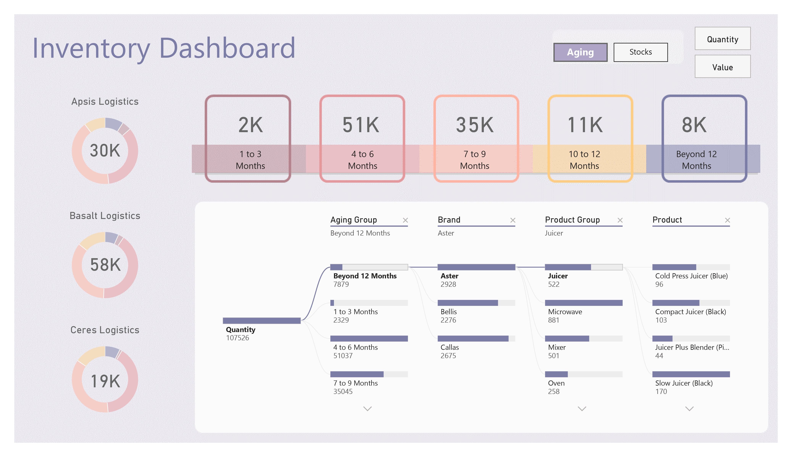
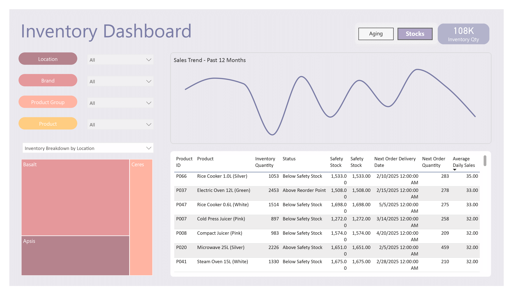

# 📊 Quality Shoppers Inventory Analysis Dashboard

## 🏪 Executive Summary

This Power BI dashboard provides a comprehensive view of **inventory health** for Quality Shoppers, highlighting **aging stock**, **safety stock violations**, and **brand performance**. 

### 🔍 Key Findings:
- 🛑 **$58K of inventory at Basalt Logistics** is aging beyond **12 months**, risking obsolescence.
- ⚠️ **5 products are below safety stock levels**, including top sellers like **Cold Press Juicer (Pink)**.
- 🏷 **Aster brand dominates inventory (2,928 units)** but shows slow turnover in some categories.

## 📦 Key Insights

### 1️⃣ Inventory Aging & Obsolescence Risk

| 🚚 Logistics Partner  | ⏳ 0–3 Months | ⏳ 4–6 Months | ⏳ 7–9 Months | ⏳ 10–12 Months | 🔴 Beyond 12 Months |
|----------------------|--------------|--------------|--------------|---------------|------------------|
| Apsis Logistics     | 2K           | 51K          | 35K          | 11K           | 8K               |
| Basalt Logistics    | –            | –            | –            | –             | **58K (❗High risk)** |
| Ceres Logistics     | –            | 19K          | 35K          | –             | –                |

#### ⚠️ Risk Analysis:
- **$58K at Basalt Logistics** has been stagnant for **over 12 months**—**urgent action needed** (e.g., discounts, bundling).
- **Apsis Logistics** has **$35K in the 7–9 month range**, nearing obsolescence.

🔹 **Recommendations:**
- 📉 **Launch a clearance sale** for aged inventory at **Basalt Logistics**.
- 📊 **Adjust purchasing forecasts** to prevent overstocking (e.g., reduce orders for slow-movers like **Mizer**).

### 2️⃣ Safety Stock Violations

#### 🚨 Products Below Safety Stock Levels:
- 🍚 **Rice Cooler 1.0L (Silver)** – **1,053 units** (Safety stock: **1,533**)
- 🥤 **Cold Press Juicer (Pink)** – **897 units** (Safety stock: **1,272**)
- 🍹 **Compact Juicer (Pink)** – **983 units** (Safety stock: **1,574**)

📉 **Impact:** Stockouts could lead to **lost sales** and **customer dissatisfaction**.

🔹 **Recommendations:**
- 🚀 **Prioritize replenishment** for juicers and rice coolers (high-demand items).
- 🔔 **Set up automated alerts** for stock levels falling below **110% of safety stock**.

### 3️⃣ Brand & Product Performance

#### 📢 Top Brands by Inventory Volume:
- 🏷 **Aster** – **2,928 units**
- 🏷 **Bells** – **2,276 units**
- 🏷 **Cilias** – **2,675 units**

#### 🐢 Slow-Moving Products:
- 📉 **Miconave (881 units)** and **Oven (258 units)** show **low turnover**.

🔹 **Recommendations:**
- 🎁 **Bundle slow-movers** with bestsellers (e.g., **Aster blenders with Miconave accessories**).
- 📊 **Analyze sales trends** to determine if slow stock is due to **pricing or demand shifts**.

### 4️⃣ Location-Level Insights

- 📉 **P066 (Rice Cooler 1.0L)** and **P007 (Cold Press Juicer)** are critically low **across multiple locations**.
- 📦 **P020 (Microwave 25L) is overstocked** (**2,226 units vs. 1,651 safety stock**).

🔹 **Recommendations:**
- 🔄 **Transfer inventory** of overstocked items (e.g., microwaves) to locations with shortages.
- 🌍 **Use geographic sales data** to align stock levels with **regional demand**.

## 📊 Dashboard Features

✅ **Interactive Filters:** Drill down by brand, product group, or location.  
✅ **Aging Analysis:** Color-coded by time buckets (e.g., **red for >12 months**).  
✅ **Real-Time Alerts:** Highlight safety stock violations.  

## 🎯 Strategic Recommendations

### 🔥 Liquidation Plan:
- 💰 **Discount aged inventory** (>9 months) by **20–30%**.

### 🤝 Vendor Collaboration:
- 📦 Work with **Basalt Logistics** to **reduce holding costs**.

### 📈 Demand Forecasting:
- 📊 Integrate **historical sales data** to optimize **purchasing**.

## 🏁 Conclusion

This dashboard reveals **critical gaps in inventory management**, from **aging stock** to **replenishment risks**. **Immediate actions** can reduce **carrying costs** and **improve product availability**.

### 🚀 Next Steps:
- 🔗 **Link inventory data** to sales to identify **dead stock faster**.
- ⏳ **Add lead time metrics** to safety stock calculations.
